# 🏗️ Spec Builder Framework
### 智能规格工程自动化引擎 (Agentic Spec Engineering Engine)

[](./docs/PRD_Spec_Builder.md)
[](https://opensource.org/licenses/MIT)

> **🚀 一个基于 Agentic Workflows 的元架构框架，实现“从需求到规格”的全自动生产闭环。**

---

### 📌 声明 (Notice)
> ⚠️ **重要**：本项目中的 `docs/PRD_Spec_Builder.md` 及其关联的 `_specs` 目录仅作为本框架的**演示示例数据**，用于展示框架在处理复杂需求时的闭环审计与产出质量。

---

## 🧭 项目定位 (Project Identity)

本仓库致力于打造 **规格自动化管线 (Spec Engine)**。通过逻辑驱动与标准强制，将模糊意图转化为硬核规格。

| 模块           | 路径                | 核心职能                                   |
| :------------- | :------------------ | :----------------------------------------- |
| **⚡ 核心引擎** | `.agent/workflows/` | 负责审计、生成、自愈的原子指令逻辑         |
| **🧠 标准库**   | `prompt/`           | 沉淀资深专家人设、Anti-NIH 及硬核 NFR 标准 |
| **📂 工作空间** | `docs/`             | 用户存放 PRD 及其生成 Specs 资产的设计现场 |
| **📑 模板库**   | `templates/`        | 标准化的工程文档脚手架与 DSL 约束          |

---

## 📖 术语表 (Glossary)

为了帮助您快速理解本框架的核心概念，请参考下表：

| 术语               | 英文全称           | 解释                                                                           |
| :----------------- | :----------------- | :----------------------------------------------------------------------------- |
| **规格 (Spec)**    | Specification      | 具有工程落地指导意义的结构化技术文档（如 接口规范、方案设计等）。              |
| **需求文档 (PRD)** | PRD                | 框架的最上游输入，定义了产品的业务逻辑与核心功能，需通过 85 分门禁审计。       |
| **规格驱动工程**   | Spec-Driven Eng    | 以规格作为 SSOT（单一事实来源），驱动全生命周期自动化研发的架构范式。          |
| **自愈循环**       | Self-Healing Loop  | 框架核心逻辑：通过“审计-反馈-修复”的闭环迭代，自动提升规格质量的机制。         |
| **高质量门禁**     | Quality Gate       | 准入/准出衡量的强制得分标准，用于确保低质量资产不进入下一研发环节。            |
| **置信度得分**     | Confidence Score   | 框架审计引擎给出的定量评分，代表了规格与需求一致性及技术落地可行性。           |
| **拒造轮子原则**   | Anti-NIH Principle | 框架倡导的技术架构审美：强制约束重复建设，优先复用标准的工业级成熟方案。       |
| **硬核 NFR 标准**  | Hardcore NFRs      | **硬核非功能性需求**。框架强制执行的安全性、鲁棒性与成本控制等工业级底层标准。 |
| **资深专家人格**   | Veteran Persona    | 框架内置的**审计灵魂**。模拟资深架构师视角，进行严苛的技术评审与漏洞挖掘。     |
| **智能体工作流**   | Agentic Workflow   | 寄生于开发环境、具备循环决策与自愈能力的工业级可编程任务处理流。               |

---

## ⚙️ 工作流运行机理 (Workflow Mechanism)

本框架的核心是 **Spec Factory** 闭环，它通过“循环审计”与“自愈修复”确保文档达到工业级落地标准：

```mermaid
graph TD
    Start([📥 输入: 原始 PRD]) --> Init[⚙️ 环境初始化: 定义工作区与配置]
    Init --> Phase1{🔍 阶段 1: PRD 质量审计}
    Phase1 -->|❌ 得分 < 85| Abort([🛑 中止: 提示用户优化 PRD])
    Phase1 -->|✅ 得分 >= 85| Phase2[🏗️ 阶段 2: 规格初始生成]
    
    Phase2 --> LoopStart[🔄 阶段 3: 优化反馈循环]
    LoopStart --> Audit[🛡️ 独立审计: 进行覆盖度评分]
    Audit --> ScoreCheck{🏆 置信度得分 >= 90?}
    
    ScoreCheck -->|✨ 是| Delivery[🎁 阶段 4: 最终交付与清理]
    ScoreCheck -->|🔙 否| IterationCheck{🔁 迭代次数 < 5?}
    
    IterationCheck -->|🛠️ 是| Optimize[🔧 迭代优化: 针对 Audit 缺陷进行修复]
    Optimize --> Audit
    
    IterationCheck -->|🏁 否| Delivery
    Delivery --> End([🎯 输出: 工业级规格资产集])

    subgraph Standards [⚖️ 核心标准驱动]
        direction TB
        AntiNIH[🚫 Anti-NIH Principle]
        NFR[🛡️ Hardcore NFRs]
        Veteran[🎖️ Veteran Persona]
    end
    
    Optimize -.-> Standards
    Audit -.-> Standards
    Phase2 -.-> Standards
```



---

## 💎 核心框架组件 (Core Framework)

*   **⚡ Agentic Workflows** (`.agent/workflows/`)
    *   提供 `/audit-prd`, `/gen-specs`, `/audit-specs` 等原子指令。
    *   集成 `/spec-factory` 全自动生产闭环逻辑。
*   **🧠 Framework Prompts** (`prompt/`)
    *   **Veteran Persona**: 模拟 15+ 年架构经验的严苛评审视角。
    *   **Anti-NIH**: 强制执行“不造轮子”准则，优先复用工业级组件。
    *   **Hardcore NFRs**: 预定义租户隔离、PII 脱敏、幂等性等非功能性标准。
*   **📜 Templates** (`templates/`)
    *   提供符合 **Spec-Driven Engineering** 范式的标准 Markdown 架构。

---

## 🛠️ 使用指南 (How to Run)

本框架寄生于智能 IDE（如 Cursor/Windsurf/Antigravity），通过运行工作流指令启动：

1.  **准备入口** 📥
    在 `docs/` 目录下放置您的原始需求文档（PRD）。
2.  **启动引擎** 🚀
    运行全自动工厂指令：
    ```bash
    /spec-factory prd_path="docs/Your_PRD.md"
    ```
3.  **获取资产** 📦
    框架将自动在 `docs/` 下生成规格集（Specs）、追溯矩阵（Matrix）及开发计划（Plan）。

---

## 📂 目录结构 (Structure)

| 目录             | 性质          | 描述                               |
| :--------------- | :------------ | :--------------------------------- |
| **`.agent/`**    | **Logic**     | 存放核心 Workflows 执行逻辑        |
| **`prompt/`**    | **Policy**    | 框架强制执行的技术审美与非功能标准 |
| **`docs/`**      | **Workspace** | **用户工作空间**，产出物存放地     |
| **`templates/`** | **Blueprint** | 规格生成的标准骨架                 |

---

## ⚖️ 许可 (License)

本项目采用 **MIT 许可证** 授权。

---
© 2025 **SparkForge Team**. *Crafting the Future of Spec-Driven Engineering.*
