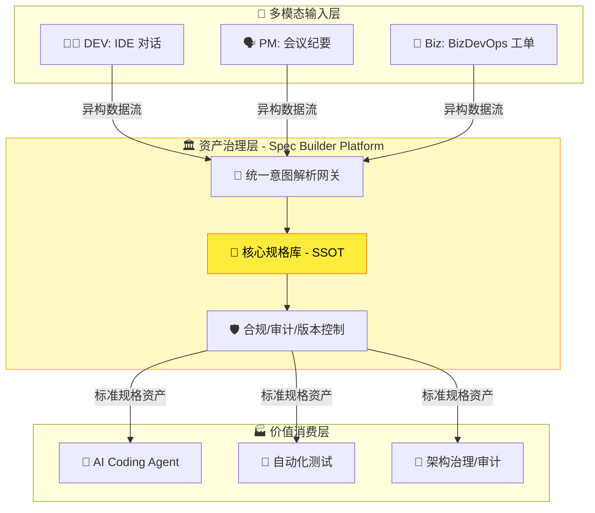
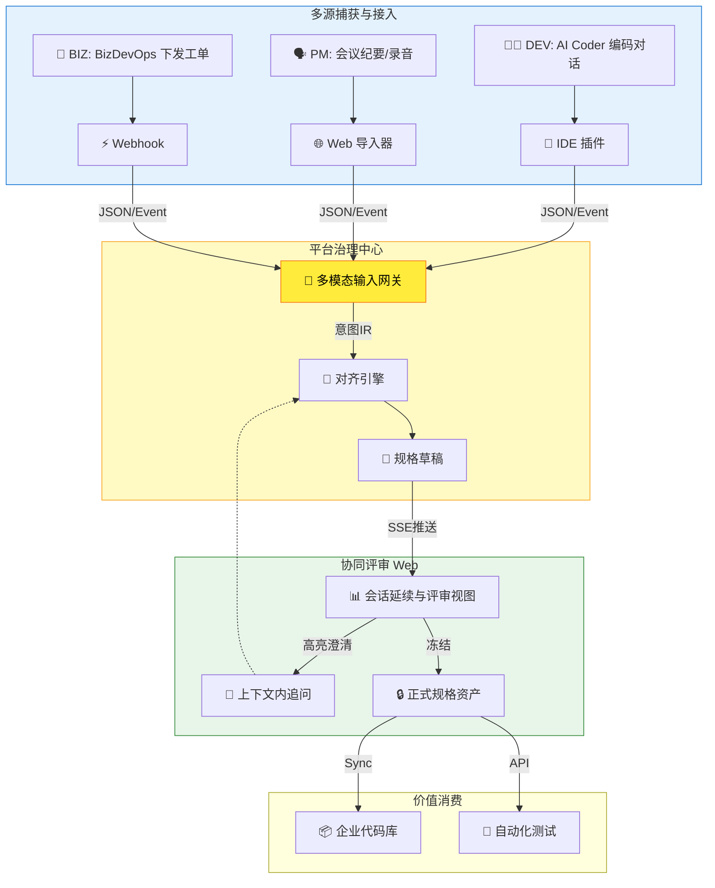
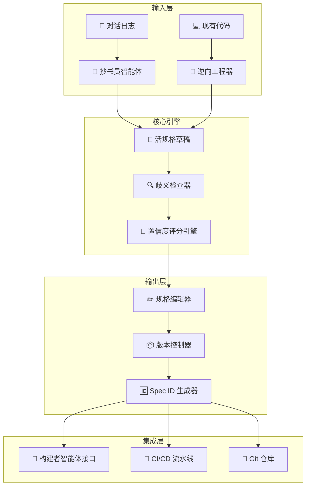
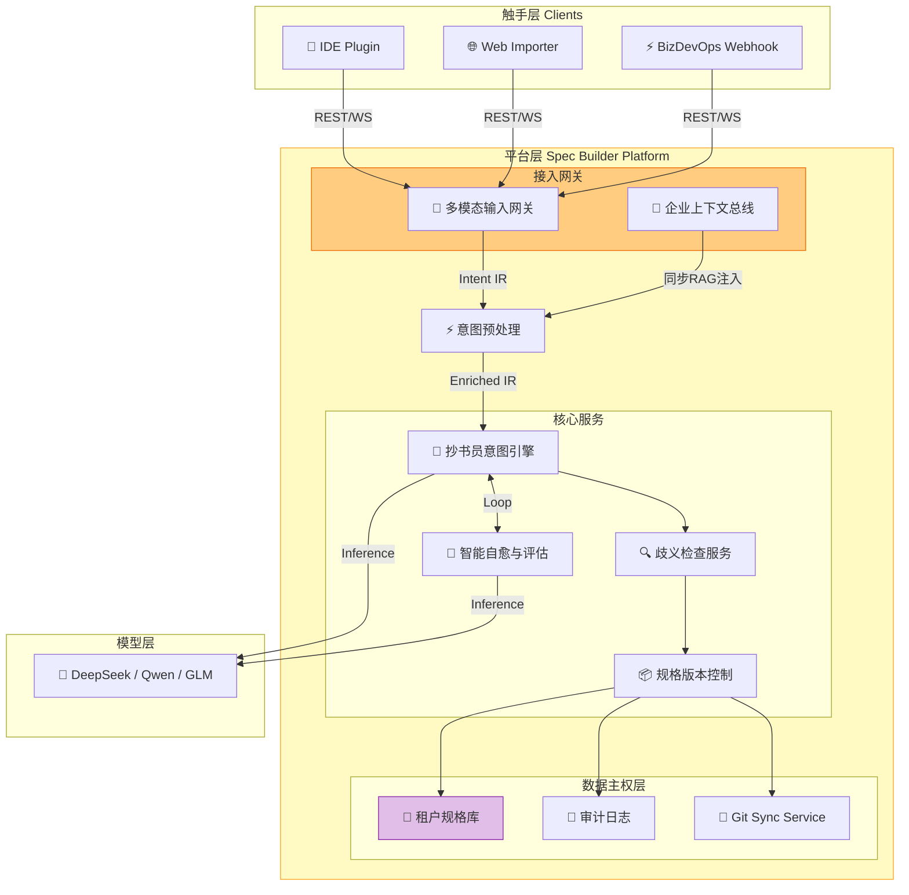

# Spec Builder - 产品需求文档 (PRD)

**版本**: 1.0 Final  
**状态**: Release  
**创建日期**: 2025-12-22  
**文档所有者**: SparkForge Team

---

## 1. 🚀 执行摘要

### 1.1 🚀 产品愿景

**Spec Builder** 是一款**企业级研发资产治理平台**。它不仅仅是一个工具，而是企业研发知识的**中央枢纽**。其核心使命是：

> **将企业内多源、异构的需求意图（AI Coder 对话、会议纪要、需求工单等），统一沉淀为可治理、可追溯、可执行的结构化规格资产。**

通过将传统的**文档维护负担**转化为驱动 AI 的**核心资产增值**，Spec Builder 确保企业在享受 AI 编码红利的同时，牢牢掌握**业务逻辑的数据主权**，建立起能够抵御人员流动和 AI 模型漂移的**意图长城**。

### 1.2 🧭 产品定位：AI 时代的“意图长城”

**核心洞察**：AI 编码时代的企业危机不在于代码写得不够快，而在于**业务逻辑的分散化与不可见化**。当需求散落在 BizDevOps 平台、IM 工具和个人的 AI Coder 对话中时，企业失去了对核心资产的掌控。

Spec Builder 定位于企业研发体系的**意图治理层 (Intent Governance Layer)**：



**与现有工具的关系**：Spec Builder 不是 AI Coder 的竞争对手，而是**其数据上游的管理者**。AI Coder 仅作为本平台的**数据采集触手**之一。所有意图最终汇聚于 Spec Builder 平台进行清洗、对齐和分发。

### 1.3 💎 核心价值主张

| 痛点                               | Spec Builder 解决方案                    |
| :--------------------------------- | :--------------------------------------- |
| 对话漂移：LLM 在长对话中丢失上下文 | 将对话实时结晶为**活规格文档**           |
| 意图不对齐：AI 生成"不是我要的"    | 提供**歧义检查器**，在编码前拦截模糊需求 |
| 规格成本高：手写规格耗时且抵触     | **抄书员智能体**自动从对话中提取规格草稿 |
| 规格与代码脱节：文档更新滞后       | **双向同步**机制，确保代码与规格一致     |

---

## 2. 🎯 目标用户分析

### 2.1 👥 用户画像

#### 主要用户：技术架构师 / 高级开发者

```yaml
Persona: "Alex - 技术架构师"
  背景:
    - 10年软件开发经验，3年团队管理
    - 负责系统设计与技术决策
    - 日常使用 VSCode/IntelliJ + AI 编码助手
  痛点:
    - 需求讨论后，规格文档总是延迟交付
    - 团队成员对需求理解不一致，返工频繁
    - AI 生成的代码经常"偏离轨道"，需大量人工调试
  期望:
    - 需求对话后自动生成 80% 的规格草稿
    - 规格中的歧义被自动高亮并提供修复建议
    - 规格变更自动触发代码适配提醒
```

#### 次要用户：产品经理 / 业务分析师

```yaml
Persona: "Lisa - 产品经理"
  背景:
    - 5年产品管理经验
    - 精通业务领域，但技术知识有限
    - 经常与开发团队进行需求沟通
  痛点:
    - 技术术语难以准确表达
    - 需求被开发"曲解"后才发现问题
    - 难以追踪需求从定义到实现的全过程
  期望:
    - 用自然语言描述需求，系统自动转化为技术规格
    - 能直观看到规格与代码的关联
    - 规格变更历史可追溯
    - 能通过共享链接在浏览器中直接评审规格草稿，无需安装软件或登录 Git 平台
```

### 2.2 🗺️ 用户旅程图



**图例**：(蓝色) **捕获接入 (IDE/Hooks)** | (黄色) **核心治理 (Platform)** | (绿色) **人工评审 (Web)**

> 本旅程采用 **「IDE 热捕获 + Web 温评审」** 双端协同模式（详见 §3.2.6）。开发者在 IDE 中无感发起，在云端平台利用结构化编辑器完成深度的规格治理与冻结。

---

## 3. 🏗️ 功能需求规格

### 3.1 📐 功能架构概览



### 3.2 ✨ MVP 功能集 (V1)

#### 3.2.1 🤖 抄书员智能体（Scribe Agent）

**功能描述**：  
分析需求对话历史，自动抽取结构化规格草稿，并自动触发后台自愈流程。

**用户故事**：

| ID     | 用户故事                                                                                                                           | 验收标准                                                                                            | 优先级 |
| :----- | :--------------------------------------------------------------------------------------------------------------------------------- | :-------------------------------------------------------------------------------------------------- | :----- |
| US-001 | 作为架构师，我希望在对话过程中，系统能**渐进式**地基于对话历史生成规格草稿                                                         | 30分钟对话，通过实时交互确认，最终形成置信度评分 > 0.8 的规格草稿                                   | P0     |
| US-002 | 作为架构师，我希望系统在后台自动尝试修复草稿中的明显错误（如字段缺失），而不是将所有问题都抛给我处理                               | 自愈引擎对结构性错误的修复成功率 > 80%                                                              | P0     |
| US-003 | 作为架构师，我希望草稿以 Markdown/YAML 混合格式呈现，便于人机共读                                                                  | 输出格式必须符合 **§3.2.7 定义的‘可执行规格’Profile**，包含完整的元数据、API契约与Gherkin验收标准。 | P0     |
| US-004 | 作为架构师，我希望草稿中低置信度区域被自动高亮                                                                                     | 每个抽取实体附带置信度评分 (0-1)                                                                    | P0     |
| US-005 | 作为架构师，我希望在对话过程中，系统能**实时高亮**潜在关键实体，并在对话间隙的侧边栏中，以**非中断式列表**向我提问以确认其具体定义 | 实体高亮延迟 ≤ 1s；侧边栏确认列表在每轮 AI 响应后 ≤ 5s 内更新；支持批量接受/拒绝/修正               | P0     |
| US-006 | 作为架构师，我希望能一键接受/拒绝建议修改                                                                                          | 提供行内差异对比 + 批量操作                                                                         | P1     |

**置信度评分维度**：上下文支持度 (40%)、歧义程度 (30%)、完整性 (30%)

#### 3.2.1.1 🎨 交互规范：IDE 侧深度体验 (L3 理想态)

> ⚠️ **注意**：本节描述的 **L3 深度寄生体验** 为理想目标。在 L2 浅度寄生模式下（API 能力受限），具体交互规范遵循 **§3.2.6**。

**目标**：在「不打断」与「不遗漏」之间取得最佳平衡。

**视觉优先级（四级颜色编码）**：

| 级别   | 颜色      | 条件                                       | 行为建议         |
| :----- | :-------- | :----------------------------------------- | :--------------- |
| 🔴 红色 | `#C62828` | 高重要性 + 低置信度                        | **必须立即处理** |
| 🟠 橙色 | `#EF6C00` | 高重要性 + 中置信度 或 中重要性 + 低置信度 | 建议尽快处理     |
| 🟡 黄色 | `#F9A825` | 中重要性 + 中置信度                        | 可稍后处理       |
| ⚪ 灰色 | `#9E9E9E` | 低重要性 或 高置信度                       | 可批量处理       |

**操作动线**：

1. **行内微交互 (Inline Widget)**：非模态气泡快捷操作（✅/✏️/❌）。
2. **侧边栏任务中心**：常驻未处理项计数器。
3. **会话总结**：对话结束时弹出确认摘要。

#### 3.2.1.2 🧩 结构化补录器 (Structured Form Filler)

**背景**：**这是核心自动化流程的冗余备份机制**。仅在 §3.2.1.3 的智能自愈引擎达到熔断条件后，为用户提供高效的手动修正能力。其使用频率是衡量自愈引擎有效性的关键反向指标。

**功能描述**：
针对 §3.2.7 定义的 OpenAPI 和 Gherkin 复杂结构，提供 Low-Code 表单编辑器，替代纯文本编辑。

**用户故事**：

| ID     | 用户故事                                                       | 验收标准                                                                | 优先级 |
| :----- | :------------------------------------------------------------- | :---------------------------------------------------------------------- | :----- |
| US-007 | 作为架构师，我希望通过表单添加缺失的 API 字段，而不是手写 YAML | 支持 OpenAPI 字段的可视化增删改（无需记忆缩进）                         | P0     |
| US-008 | 作为架构师，我希望通过模板快速录入验收用例，而不是手写 Gherkin | 提供 `Given/When/Then` 填空模板，自动格式化为 Gherkin                   | P0     |
| US-009 | 作为架构师，我希望在“对话”与“表单”间无缝切换，数据保持同步     | Chat 中确认的内容自动填充到 Form；Form 修改的内容实时同步到 Chat 上下文 | P1     |

#### 3.2.1.3 🧠 智能自愈引擎 (Agentic Self-Correction)

**功能描述**：
在“抄书员智能体”生成初稿后、提交用户评审前，插入一个后台自动化质量提升循环。

**核心组件**：

1. **Validator Agent**：基于 §3.2.7 的“可执行规格 Profile”和 §3.2.3.1 的“冻结质量门控清单”，对草稿进行自动化结构完整性、逻辑一致性校验。输出一份结构化的“缺陷报告”。
2. **Reflector Agent**：接收 Validator 的“缺陷报告”，结合原始对话上下文（Intent IR），分析缺陷产生的根本原因（如上下文缺失、实体歧义），并生成一份“修正指令”。
3. **Corrector Agent**：接收 Reflector 的“修正指令”，对原始草稿执行定向修正或补全。

**循环控制**：

- **预算控制**：单次意图处理的总 Token 预算上限 < ¥0.4。Validator/Reflector 使用轻量模型。
- **熔断机制**：最大循环 3 次或质量提升停滞时终止。
- **延迟管理**：通过 SSE 向前端推送“AI 正在深度优化草稿 (X/3)...”状态。

---

#### 3.2.2 🔍 歧义检查器（Ambiguity Linter）

**功能描述**：  
静态分析规格文档，识别模糊术语、缺失验收标准等问题。

**用户故事**：

| ID     | 用户故事                                                         | 验收标准                       | 优先级 |
| :----- | :--------------------------------------------------------------- | :----------------------------- | :----- |
| US-010 | 作为架构师，我希望系统自动标记模糊术语（如「快速」「用户友好」） | 检测率 > 85%（基于黄金测试集） | P0     |
| US-011 | 作为架构师，我希望系统为模糊术语提供精确替代建议                 | 每个标记附带至少1条可量化建议  | P0     |
| US-012 | 作为架构师，我希望在保存规格时自动运行检查                       | 保存触发检查，阻塞冻结操作     | P1     |

---

#### 3.2.3 📦 一键版本化（One-Click Versioning）

**功能描述**：  
将规格草稿冻结为正式版本，生成唯一 Spec ID，提交至 Git。

**用户故事**：

| ID     | 用户故事                                             | 验收标准                                 | 优先级 |
| :----- | :--------------------------------------------------- | :--------------------------------------- | :----- |
| US-013 | 作为架构师，我希望点击「冻结」后，规格被快照并版本化 | 生成 `spec/<module>/<version>.yaml` 文件 | P0     |
| US-014 | 作为架构师，我希望每个冻结版本有唯一 Spec ID         | ID 格式：`SPEC-<module>-<semver>-<hash>` | P0     |
| US-015 | 作为架构师，我希望冻结操作自动提交至 Git             | 自动创建带标准 commit message 的 commit  | P1     |
| US-016 | 作为架构师，我希望在冻结前必须通过歧义检查           | 检查未通过时，冻结按钮禁用               | P0     |

#### 3.2.3.1 🛡️ 冻结质量门控清单 (Freeze Quality Gate)

为确保冻结的规格为“可执行资产”，冻结操作必须满足以下硬性校验规则，否则冻结按钮将保持禁用状态并高亮提示未满足项：

1. **Profile结构完整性**：输出文档必须包含 §3.2.7 定义的全部三个部分：Frontmatter元数据、OpenAPI契约、Gherkin验收标准。
2. **高优实体清零**：所有被标记为 🔴 (红色) 级别的待确认实体必须已被用户处理（接受、拒绝或修订）。
3. **OpenAPI契约底线**：OpenAPI `paths` 下的每个 `operation` 必须定义至少一个 `responses`。
4. **Gherkin场景底线**：每个 `Feature` 必须包含至少一个 `Scenario`。
5. **歧义检查通过**：必须通过 §3.2.2 定义的歧义检查器校验。

---

#### 3.2.4 🔄 逆向工程器（Reverse Engineer）

**功能描述**：  
从现有代码中自动提取规格草稿，实现「代码 → 规格」的反向映射。

**用户故事**：

| ID     | 用户故事                                               | 验收标准                     | 优先级 |
| :----- | :----------------------------------------------------- | :--------------------------- | :----- |
| US-017 | 作为架构师，我希望从现有 API 代码生成 OpenAPI 规格草稿 | 支持 Java/Go/Python 主流框架 | P1     |
| US-018 | 作为架构师，我希望从数据库 Schema 生成实体规格         | 支持 PostgreSQL/MySQL DDL    | P2     |
| US-019 | 作为架构师，我希望生成的规格与现有规格进行差异对比     | 高亮不一致之处，建议同步方向 | P1     |

---

### 3.2.5 🚀 MVP 进入策略 (Enterprise-First Go-to-Market)

本策略明确：**Spec Builder 是一个平台，而不是一个插件**。MVP 的核心任务是验证「多源意图清洗 → 标准规格生成」的业务闭环。

#### 3.2.5.1 🏛️ 核心产品：企业需求分析平台 (V1)

**定位**：系统的**心脏与大脑**。所有数据流的终点，协作流的起点。

| 模块               | 职责                                                                                         |
| :----------------- | :------------------------------------------------------------------------------------------- |
| **多模态输入网关** | 统一接收/解析 API 请求，负责将异构输入源转换为符合 §5.4 标准的统一意图中间表示（IR）。       |
| **云端协作中心**   | 它是全功能的 SPA，提供规格的查看、编辑、评审、版本回溯、分支合并                             |
| **企业上下文总线** | 通过向 Intent IR 的 `contextual_enrichment` 字段注入结构化知识，实现企业上下文的标准化融合。 |

#### 3.2.5.2 🐙 数据采集触手 (Plugins & Integrations)

**定位**：系统的**手与眼**。负责深入各业务场景，捕获原始意图数据。

| 触手类型              | 优先级 | 职责                                              |
| :-------------------- | :----- | :------------------------------------------------ |
| **IDE 插件 (VsCode)** | P0     | 捕获开发者对话流，实现「热捕获」机制（见 §3.2.6） |
| **Web 导入器**        | P0     | 允许 PM 直接粘贴/上传会议纪要文本、语音转录文件   |
| **BizDevOps Webhook** | P1     | 监听工单创建/更新事件，自动触发规格草稿生成       |

#### 3.2.5.3 🛡️ 技术可行性验证门控

在启动 MVP 开发前，必须完成以下技术侦查任务：

1. **企业数据隔离验证**：验证私有化部署方案能否通过标准的企业安全与网络隔离测试。
2. **触手连通性验证**：验证 VSCode 插件能否在企业内网环境下，安全地与私有化平台进行双向通信 (SSE/WebSocket)。
3. **多模态解析能力**：验证当前 LLM 模型对长篇会议纪要（>10k Tokens）的摘要准确率是否达到 MVP 标准（>80%）。

---

### 3.2.6 🕸️ L2 模式交互规范 (针对浅度寄生场景)

本规范定义了当 IDE API 仅允许捕获对话（不支持 UI 注入）时的降级交互标准，确保「热捕获 - 温评审」的体验闭环。

#### 3.2.6.1 🔥 热捕获机制 (IDE 侧)

**核心职责**：在这一阶段，由 IDE 插件负责「聆听」而非「打断」。

1. **无感采集**：插件在后台持续分析对话流，状态栏必须有动态视觉反馈（如 🟣 脉冲动画）。
2. **智能触发**：
   - **关键词触发**：检测到「总结一下」「确认需求」「生成文档」等意图。
   - **静默触发**：对话暂停超过 90s，且积累了高置信度实体。
   - **交互动作**：弹出非模态 Notify/Toast 提示：「已捕获关键上下文，点此生成并评审草稿」。
3. **一键接力**：点击提示后，自动打开默认浏览器，携带 `session_id` 和上下文摘要，导航至云端客户端专属页面。

#### 3.2.6.2 🌡️ 温评审体验 (Web 侧)

**核心职责**：在这一阶段，Web 平台提供沉浸式的编辑与治理环境，支持**双模评审**。

1. **会话延续视图（三栏式布局）**：
   - **[左] 对话原文**：完整同步 IDE 对话，支持滚动，关键实体高亮显示。
   - **[中] 规格草稿 (Dual Mode)**：
     - **Markdown View**: 适合阅读与整体评审。
     - **Form View**: 基于 §3.2.1.2 的结构化编辑器，适合对 API 参数、Gherkin 用例进行精细化修正。
   - **[右] 待确认项**：基于视觉优先级标准排序的确认列表（🔴/🟡）。
2. **上下文内澄清**：
   - 在右侧列表点击待确认项 → 中间草稿自动滚动定位 → **若处于 Form View，自动聚焦到对应表单输入框**。
3. **闭环协作**：
   - 点击「冻结」时，系统将依据 §3.2.3.1 的质量门控清单进行校验。若校验通过，则完成冻结并生成分享链接。

---

### 3.2.7 📜 可执行规格 (Executable Spec Profile)

为保证规格能被下游 AI Coder 无歧义地消费，所有输出的规格文档必须遵循以下混合格式标准：

**File Structure**:

```markdown
---
spec_id: "SPEC-AUTH-1.0.0" (UUID v4)
source_references: 
  - { type: "ide", id: "session-abc" }
  - { type: "bizdevops", id: "PROJ-123" }
version: "1.0.0"
title: "用户登录模块规格"
last_updated: "2025-12-22T10:00:00Z"
tags: ["auth", "security", "core"]
---

# 用户登录模块

## 1. 业务概述

（Markdown 格式的自然语言描述，供人类阅读）

## 2. API 契约 (OpenAPI 3.1)

（内嵌 OpenAPI YAML 代码块）

## 3. 验收标准 (Gherkin)

（内嵌 Gherkin 代码块）
```

---

### 3.3 ⏳ 延后功能 (V2 及以后)

| 功能                 | 说明                                   | 门控条件                     |
| :------------------- | :------------------------------------- | :--------------------------- |
| **实时抽取**         | 对话过程中后台实时监听并抽取实体       | V1 用户反馈 + 技术可行性评估 |
| **双向同步**         | 代码变更时，规格自动更新或触发告警     | 逆向工程器成熟度             |
| **规格覆盖率仪表盘** | 可视化展示 Spec-Verified-Lines-of-Code | MVP 上线后的数据积累         |
| **多智能体协作**     | 抄书员 + 构建者 + 测试员智能体协同工作 | 单智能体能力验证             |

---

## 4. ⚙️ 非功能需求

### 4.1 ⚡ 性能需求

| 指标             | 目标值                      | 测量方法 |
| :--------------- | :-------------------------- | :------- |
| 规格综合响应时间 | 30分钟对话 → < 60s 生成草稿 | P95 延迟 |
| 歧义检查响应时间 | < 2s（1000行规格文档）      | P95 延迟 |
| 系统可用性       | ≥ 99.5%                     | 监控指标 |

### 4.2 🖱️ 可用性需求

| 需求           | 描述                                           |
| :------------- | :--------------------------------------------- |
| 零陡峭学习曲线 | 熟悉 VSCode 的开发者应在 15 分钟内上手核心功能 |
| 国际化         | 首发支持中文/英文界面                          |

### 4.3 🔗 集成需求 (Enterprise Integration)

Spec Builder 通过 **标准协议网关** 与企业现有生态进行集成：

| 集成对象           | 协议/模式              | 实现方式                                                              |
| :----------------- | :--------------------- | :-------------------------------------------------------------------- |
| **身份认证 (IAM)** | OIDC / SAML 2.0        | 平台作为 SP 对接企业 AD/LDAP。                                        |
| **代码托管 (Git)** | Git API / Webhook      | 平台持有 Token，实现规格文件的自动 Sync。                             |
| **BizDevOps 平台** | Webhook / API          | 双向同步：工单变更 -> 触发规格草稿；对接内部项目管理能力。            |
| **AI 编码助手**    | Model Context Protocol | 平台作为 MCP Server，向 AI Coder 提供经过清洗的高质量上下文 (Slice)。 |

#### 4.3.1 🔌 MCP 接口定义

平台作为 **MCP Server**，通过标准协议暴露以下能力：

1. **Resources (上下文资源)**:
   - `spec://{spec_id}/full`: 获取完整规格 Markdown。
   - `spec://{spec_id}/openapi`: 仅获取 OpenAPI 定义。
   - `spec://{spec_id}/gherkin`: 仅获取验收标准。
2. **Tools (增强工具)**:
   - `search_specs(query)`: 语义搜索企业规格库。
   - `analyze_impact(entity_name)`: 分析实体变更对规格的潜在影响。

### 4.4 🔒 安全与合规需求 (Security & Compliance)

基于「数据主权」原则，所有核心逻辑在平台侧闭环，触手端零信任。

1. **私有化部署**：支持 Docker/K8s 离线部署，数据不出内网。
2. **数据隔离**：基于 RBAC 的租户隔离。
3. **PII 脱敏**：入库前自动掩码敏感信息。
4. **全审计**：持久化记录 `processing_metadata`，确保 RAG 注入过程可追溯。

---

## 5. 🏛️ 技术架构

### 5.1 📐 系统架构图



**分层说明**：

- **触手层 (Clients)**: 负责多模态数据的**零接触采集**。支持 IDE 插件热捕获和 Webhook 异步摄入。
- **平台层 (Platform)**:
  - **接入网关**: 负责流量清洗、鉴权与 PII 敏感信息脱敏。
  - **核心服务**: 包含抄书员引擎（生成）、**智能自愈引擎**（质量闭环 §3.2.1.3）和歧义检查器。
  - **数据主权层**: 本地化存储所有规格资产与审计日志，仅通过 Git Sync 服务与企业代码库同步。
- **模型层 (AI Model)**: 算力底座，支持私有化 LLM 部署。

### 5.2 💻 关键技术栈 (Tech Stack)

| 领域           | 选型方案                  | 说明                                                       |
| :------------- | :------------------------ | :--------------------------------------------------------- |
| **后端框架**   | Java 17 + Spring Boot 3.2 | 企业级标准，高并发与稳定性保障。                           |
| **Agent 框架** | **Spring AI**             | 统一封装 LLM 调用，编排 Validator/Corrector 多智能体循环。 |
| **网关组件**   | Spring Cloud Gateway      | 统一鉴权、流控与 PII 处理。                                |
| **数据存储**   | PostgreSQL + pgvector     | JSONB 存储 Intent IR，pgvector 支撑 RAG 检索。             |
| **前端架构**   | React + TailwindCSS       | 构建现代化的 SPA 协作界面。                                |
| **消息/异步**  | RabbitMQ                  | 解耦高并发意图摄入与自愈循环的异步处理。                   |

### 5.3 🔌 核心接口契约 (Core Interfaces)

#### 5.3.1 ⬆️ 北向接入 API (Ingestion)

面向数据源（IDE/Webhook），负责意图的高并发采集。

- `POST /api/v1/intent/ingest`: 接收来自 Webhook 的纯异步意图事件（Fire-and-Forget）。
- `POST /api/v1/session/interact`: 处理 IDE 会话中的实时对话流与高亮确认。
- `POST /api/v1/spec/freeze`: 触发规格版本冻结与自愈流程。

#### 5.3.2 ⬇️ 南向消费 API (MCP Support)

面向消费端（AI Coding Agent），负责规格的精准分发。
详见 **§4.3.1 MCP 接口定义**。平台作为标准 **Model Context Protocol Server**：

- **Resources**: `spec://` 协议，提供规格的 Markdown/OpenAPI 切片。
- **Tools**: `search_specs`, `analyze_impact` 等工具，赋能 AI Coder。

### 5.4 🧬 统一意图数据模型 (Intent IR)

Intent IR 是平台内部所有意图处理的**标准中间表示** (IR)，用于屏蔽上游异构数据源（BizDevOps, IDE 等）的差异。

#### 5.4.1 📝 核心字段概览

| 字段                    | 类型   | 说明                                           |
| :---------------------- | :----- | :--------------------------------------------- |
| `intent_id`             | UUID   | 全局唯一标识符。                               |
| `source_metadata`       | Object | **来源元数据**。记录意图的原始出处。           |
| `raw_content`           | String | **原始快照**。未经清洗的原始输入。             |
| `core_entities`         | Array  | **核心实体**。提取出的业务实体及其置信度。     |
| `contextual_enrichment` | Object | **上下文增强**。由 RAG 注入的企业知识。        |
| `processing_metadata`   | Object | **处理指纹**。记录 PII 脱敏状态、审计追踪 ID。 |

#### 5.4.2 ℹ️ 来源元数据结构 (Source Metadata)

```json
{
  "source_type": "ide_dialogue | bizdevops_ticket | meeting_minutes | web_import",
  "source_reference": {
    "ticket_key": "PROJ-123",
    "session_id": "uuid-v4"
  }
}
```

#### 5.4.3 🗺️ 多源映射示例

- **BizDevOps 工单**：`source_reference` 存储 `{ "ticket_key": "PROJ-123" }`；`raw_content` 存储工单描述；`core_entities` 从验收标准 (AC) 中提取。
- **IDE 协作会话**：`source_reference` 存储 `{ "session_id": "uuid-v4" }`；`raw_content` 存储完整对话日志；`core_entities` 从最新的 AI Summary 中提取。

---

## 6. 📈 成功指标

### 6.1 📊 业务指标

| 维度     | 指标                                           | 目标值    |
| :------- | :--------------------------------------------- | :-------- |
| **效率** | 30分钟复杂需求会话 → 规格草稿生成 + 修订总时间 | < 10 分钟 |
| **采纳** | 开发者倾向「评审草稿」而非「从头撰写」的比例   | > 90%     |
| **质量** | 规格草稿准确率（黄金测试集）                   | > 90%     |

### 6.2 🛠️ 技术指标

| 指标             | 目标值 |
| :--------------- | :----- |
| 歧义识别率       | > 85%  |
| 可执行规格符合率 | > 95%  |

### 6.3 💰 成本指标

| 指标                        | 目标值                           |
| :-------------------------- | :------------------------------- |
| MVP 开发周期                | ≤ 3 人月                         |
| 单次规格综合 LLM Token 成本 | < ¥0.5 (其中自愈优化预算 < ¥0.4) |

---

## 7. ⚠️ 风险与缓解

| 风险                           | 缓解策略                                                                                                  |
| :----------------------------- | :-------------------------------------------------------------------------------------------------------- |
| 抄书员智能体准确率不达标       | 利用 **智能自愈引擎** (§3.2.1.3) 进行后台迭代；提供 **结构化补录器** 兜底。                               |
| 用户抵触规格撰写               | 强调「评审」而非「撰写」；提供渐进式采纳路径。                                                            |
| 自愈引擎死循环                 | 设置预算熔断机制 (Max 3 Loops)，超时自动降级为人工评审。                                                  |
| **技术风险**：逆向工程准确率低 | V1 聚焦于 **静态标准接口 (OpenAPI/SQL)** 的单次导入，人工确认后再入库；V2 再引入基于 AST 的实时双向同步。 |

---

## 8. 📚 附录：术语表

| 术语                 | 全称/分类                          | 核心定义与通俗解释                                                                                                                                                                                   |
| :------------------- | :--------------------------------- | :--------------------------------------------------------------------------------------------------------------------------------------------------------------------------------------------------- |
| **Spec**             | Specification                      | **规格**。在本平台中，指描述软件行为、接口契约和验收标准的结构化文档，是连接人类意图与 AI 编码执行的通用语言。                                                                                       |
| **SDD**              | Spec-Driven Development            | **规格驱动开发**。一种以 Spec 为核心的研发范式，主张“先写规格，后写代码”以及“规格即代码(Spec as Code)”，确保 AI 生成的代码始终“有法可依”。                                                           |
| **BizDevOps**        | Business + Dev + Ops               | **业产研运一体化**。一种将业务 (Biz)、开发 (Dev) 与运维 (Ops) 深度融合的协作文化与实践。在本平台语境下，特指**企业级全生命周期研发管理平台**，它们是 Spec Builder 获取原始业务意图的关键上游数据源。 |
| **MCP**              | Model Context Protocol             | **模型上下文协议**。一种开放标准，用于让 AI Coder 安全地读取外部数据（如本平台的规格库）。                                                                                                           |
| **Intent IR**        | Intent Intermediate Representation | **统一意图中间表示**。平台内部通用的 JSON 数据格式，用于把杂乱的聊天记录“翻译”成机器可读的标准结构。                                                                                                 |
| **Scribe Agent**     | 抄书员智能体                       | **核心 AI 引擎**。一位不知疲倦的“专业记录员”，负责旁听开发者的对话，自动整理出结构化的规格文档。                                                                                                     |
| **Spec Profile**     | Specification Profile              | **可执行规格画像**。指一份合格的规格文档必须包含的“三件套”：所有者元数据、OpenAPI 接口定义、Gherkin 验收标准。                                                                                       |
| **Gherkin**          | DSL                                | **行为驱动开发语言**。使用 `Given/When/Then` 句式描述业务规则，既让人看得懂，也能直接转为自动化测试代码。                                                                                            |
| **SSOT**             | Single Source of Truth             | **单一可信源**。指规格文档是业务逻辑的唯一法定依据，代码和测试用例都必须与其保持一致。                                                                                                               |
| **L2 / L3 Mode**     | Parasitic Level                    | **寄生等级**。**L2 浅度寄生**指仅通过 API 旁路监听（如 IDE 插件）；**L3 深度寄生**指直接嵌入宿主 UI（如在 IDE 内渲染表单）。                                                                         |
| **Data Sovereignty** | 数据主权                           | **安全原则**。指企业的核心研发资产（规格与意图）必须完全掌控在企业私有环境中，严禁未经授权流向公有大模型。                                                                                           |
| **RAG**              | Retrieval-Augmented Generation     | **检索增强生成**。指在 AI 写规格时，自动“翻阅”企业内部的术语表和历史文档，确保用词准确、风格统一。                                                                                                   |
