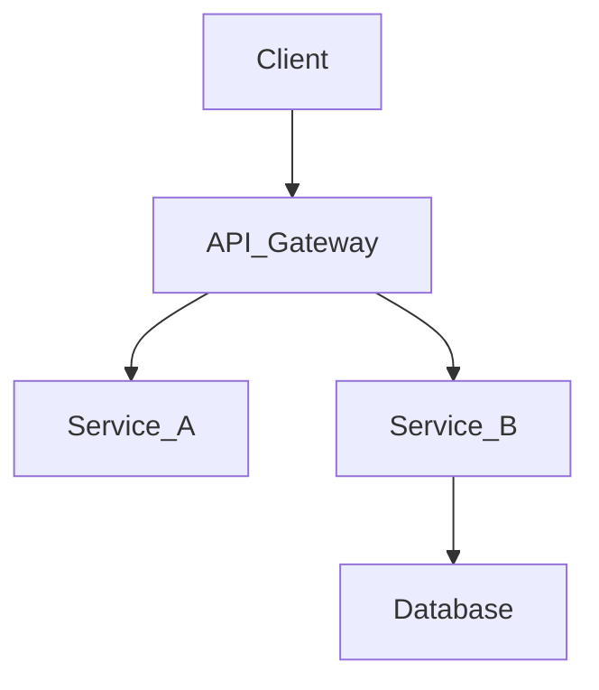
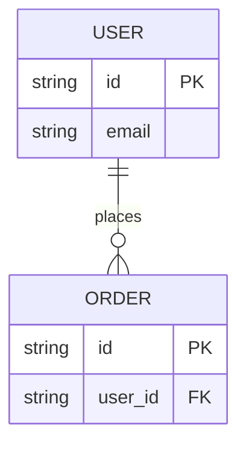

# System Design Specification (SDS) Template

> **Document Status**: [Draft | In Review | Approved]
> **Author**: [Name]
> **Last Updated**: [YYYY-MM-DD]
> **Related PRD**: [Link to PRD]

## 1. Introduction
### 1.1 Purpose
*Describe the technical goals and scope of this design document.*

### 1.2 System Overview
*High-level description of the system architecture and its role in the ecosystem.*

## 2. Architecture Design
### 2.1 High-Level Architecture (C4 Model)
*Insert system context or container diagrams here (Mermaid or Image).*



### 2.2 Component Design
*Break down the system into key components/modules.*

*   **Component A**: Responsibilities, dependencies, interfaces.
*   **Component B**: ...

### 2.3 Technology Stack
*   **Frontend**: React, Vue...
*   **Backend**: Go, Python, Node.js...
*   **Database**: PostgreSQL, Redis...
*   **Infrastructure**: AWS, K8s...

## 3. Data Design
### 3.1 Data Model (ER Diagram)
*Describe the database schema.*



### 3.2 Data Flow
*Describe how data moves through the system.*

## 4. API Design
*Define the interface contracts (REST/gRPC/GraphQL).*

### 4.1 Endpoints
**GET /api/v1/resource**
- **Request Parameters**: ...
- **Response**:
  ```json
  {
    "id": "123",
    "name": "example"
  }
  ```

## 5. Security Design
*Authentication, Authorization, Data Privacy.*
- **Auth**: OAuth 2.0 / JWT.
- **RBAC**: Role definitions.

## 6. Infrastructure & Deployment
*   **CICD Pipeline**: GitHub Actions...
*   **Deployment Strategy**: Blue/Green, Canary...
*   **Monitoring**: Prometheus, Grafana...

## 7. Performance & Scalability
*Strategy for handling load.*
- Caching strategy (Redis)
- Database sharding/indexing
- Horizontal scaling

## 8. Testing Strategy
*   **Unit Tests**: Coverage targets.
*   **Integration Tests**: Key flows.
*   **Load Testing**: Tools (k6, JMeter) and targets.

## 9. Migration Plan
*If applicable, how to migrate from legacy systems or data.*

## 10. Appendix
*References, alternative designs considered.*
